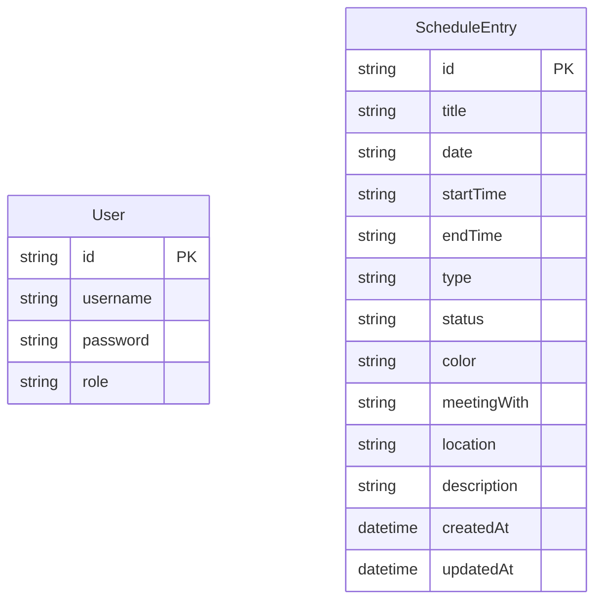
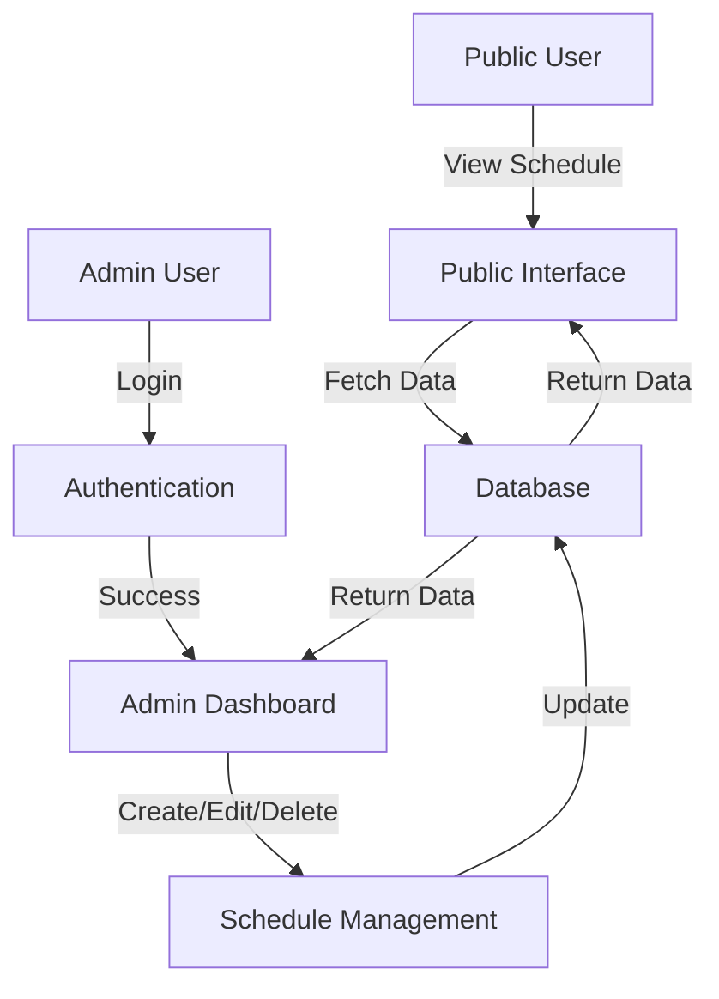
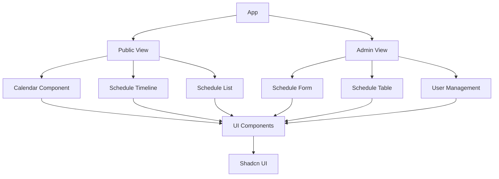

# Principal's Schedule Management System


A modern web application for managing and displaying the Principal's schedule at Sardar Patel Institute of Technology, Mumbai. This system provides both public and administrative interfaces to view and manage appointments, meetings, and events.

## 📋 Features

- **Public Schedule View**: Calendar-based interface for viewing the Principal's schedule
- **Admin Dashboard**: Secure interface for managing schedule entries
- **Responsive Design**: Works seamlessly on desktop and mobile devices
- **Filtering Options**: Filter schedule by meeting type and time range
- **Authentication**: Secure login for administrators
- **Database Integration**: Persistent storage with Prisma ORM

## 🏗️ System Architecture

### Database Schema



### System Flow



### Component Architecture



## 🛠️ Tech Stack

- **Frontend**:

  - Next.js 15.2.4
  - React 19.0.0
  - TypeScript 5.8.3
  - TailwindCSS 3.4.17
  - Shadcn UI (Radix UI components)
  - Lucide React Icons
- **Backend**:

  - Next.js API Routes
  - Prisma ORM
  - NextAuth.js for authentication
  - SQLite database (development)
- **Development Tools**:

  - pnpm package manager
  - ESLint for code linting
  - TypeScript for type safety

## 🚀 Getting Started

### Prerequisites

- Node.js 18.x or higher
- pnpm (recommended) or npm

### Installation

1. Clone the repository:

   ```bash
   git clone https://gitlab.spit.ac.in/booking/2024.git
   cd 2024

   npm install -g pnpm
   pnpm install --force --legacy-peer-deps

   cp .env.example .env
   # (edit the .env file to set DB credentials and other secrets)

   pnpm prisma migrate dev --name init
   pnpm prisma db seed

   pnpm run build
   pnpm run start


   ```

## 🔒 Authentication

The application uses NextAuth.js for authentication with the following default credentials:

- **Admin User**:
  - Username:`admin`
  - Password:`admin123`

> ⚠️ **Note**: Change these credentials in production!

## 🧩 Project Structure

```
├── app/                  # Next.js app directory
│   ├── admin/            # Admin dashboard routes
│   ├── api/              # API routes
│   ├── login/            # Authentication routes
│   └── page.tsx          # Public homepage
├── components/           # React components
│   ├── ui/               # Shadcn UI components
│   └── ...               # Custom components
├── hooks/                # Custom React hooks
├── lib/                  # Utility functions and types
├── prisma/               # Prisma schema and migrations
│   ├── schema.prisma     # Database schema
│   └── seed.ts           # Seed script for initial data
├── public/               # Static assets
└── styles/               # Global styles
```

## 📝 License

This project is licensed under the MIT License - see the LICENSE file for details.

## 🙏 Acknowledgements

- [Sardar Patel Institute of Technology](https://www.spit.ac.in/)
- [Next.js](https://nextjs.org/)
- [Prisma](https://www.prisma.io/)
- [TailwindCSS](https://tailwindcss.com/)
- [Shadcn UI](https://ui.shadcn.com/)
